
<h1><b>BAGIAN 1</b></h1>

<h1><b>PENGENALAN</b></h1>

### TUJUAN PEMBELAJARAN
- Untuk mempelajari komputer dan pemrograman
- Untuk mengkompilasi dan menjalankan program Java pertama anda
- Untuk mengenali kesalahan waktu kompilasi dan run-time
- Untuk menggambarkan suatu algoritma dengan pseudocode

### ISI BAB

**1.1 PROGRAM KOMPUTER** 2

**1.2 ANATOMI KOMPUTER** 3
Komputer C&S Ada Dimana-mana

**1.3 BAHASA PEMROGRAMAN JAVA** 6

**1.4 MENJADI MAKSIMAL DENGAN LINGKUNGAN PEMROGRAMAN** 7

Salinan Cadangan PT1

**1.5 MENGANALISIS PROGRAM PERTAMA ANDA** 11

Program Java SYN 12

CE1 Menghilangkan Titik Koma 13

**1.6 KESALAHAN** 14

CE2 Salah Eja Kata 15

**1.7 PEMECAHAN MASALAH : DESAIN ALGORITMA** 15

HT1 Mendeskripsikan Algoritma dengan
Kode semu 19

WE1 Menulis Algoritma untuk Memasang Lantai 21

Sama seperti Anda mengumpulkan alat, mempelajari proyek, dan membuat rencana untuk
mengatasinya, dalam bab ini Anda akan mengumpulkan dasar-dasar yang anda
perlukan untuk mulai belajar memprogram. Setelah perkenalan singkat perangkat keras komputer, perangkat lunak, dan pemrograman dalam umum, Anda akan belajar cara menulis dan menjalankan yang pertama program Jawa. Anda juga akan belajar cara mendiagnosis dan memperbaiki kesalahan pemrograman, dan cara menggunakan kodesemu untuk
menggambarkan suatu algoritme—deskripsi langkah demi langkah tentang bagaimana untuk memecahkan masalah—saat Anda merencanakan program komputer Anda.

# **1.1 Program Komputer**

Anda mungkin pernah menggunakan komputer untuk bekerja atau bersenang-senang. Banyak orang menggunakan komputer untuk tugas sehari-hari seperti perbankan elektronik atau menulis makalah. Komputer adalah baik untuk tugas-tugas seperti itu. Mereka dapat menangani tugas berulang, seperti menjumlahkan angka atau menempatkan kata-kata di halaman, tanpa merasa bosan atau lelah.

Fleksibilitas komputer adalah fenomena yang cukup menakjubkan. Mesin yang sama dapat menyeimbangkan buku cek Anda, meletakkan kertas istilah Anda, dan bermain game. Sebaliknya, mesin lain melakukan berbagai tugas yang jauh lebih sempit; mobil yang dikendarai dan pemanggang roti bersulang. Komputer dapat melakukan berbagai tugas karena mereka menjalankan tugas yang berbeda program, yang masing-masing mengarahkan komputer untuk bekerja pada tugas tertentu.

 
<b>Komputer itu sendiri</b> adalah mesin yang menyimpan data (angka, kata-kata, gambar), berinteraksi dengan perangkat (monitor, sistem suara, printer), dan menjalankan program. Sebuah program komputer memberi tahu komputer, secara rinci, urutan langkah-langkah yang diperlukan untuk memenuhi tugas. Komputer fisik dan perangkat periferal secara kolektif disebut <b>perangkat keras</b>. Program yang dijalankan komputer disebut **barang lunak**.
Program komputer saat ini sangat canggih sehingga sulit dipercaya bahwa mereka terdiri dari instruksi yang sangat primitif. Instruksi tipikal mungkin satu dari berikut ini:

- Letakkan titik merah pada posisi layar tertentu.
- Tambahkan dua angka.
- Jika nilai ini negatif, lanjutkan program pada instruksi tertentu.

Pengguna komputer memiliki ilusi interaksi yang lancar karena sebuah program berisi sejumlah besar instruksi semacam itu, dan karena komputer dapat mengeksekusinya di kecepatan luar biasa.

Tindakan merancang dan mengimplementasikan program komputer disebut **pemrograman**. Dalam buku ini, Anda akan belajar cara memprogram komputer yaitu cara mengarahkan komputer untuk menjalankan tugas.

Untuk menulis game komputer dengan efek gerakan dan suara atau pengolah kata yang mendukung font dan gambar mewah adalah tugas kompleks yang membutuhkan tim yang terdiri dari banyak orang programmer yang sangat terampil. Upaya pemrograman pertama Anda akan lebih biasa.Konsep dan keterampilan yang Anda pelajari dalam buku ini membentuk fondasi penting, dan Anda tidak boleh kecewa jika program pertama Anda tidak menyaingi sophis ticated perangkat lunak yang akrab bagi Anda. Sebenarnya, Anda akan menemukan bahwa ada sensasi yang luar biasa bahkan dalam tugas pemrograman sederhana. Ini adalah pengalaman yang luar biasa untuk melihat komputerdengan tepat dan cepat melaksanakan tugas yang akan memakan waktu berjam-jam kerja keras, untuk membuat perubahan kecil dalam program yang mengarah pada perbaikan segera, dan untuk melihat komputer menjadi perpanjangan dari kekuatan mental Anda.

1. Apa yang diperlukan untuk memutar musik di komputer?

2. Mengapa pemutar CD kurang fleksibel dibandingkan komputer?

3. Apa yang perlu diketahui pengguna komputer tentang pemrograman agar dapat memainkan
video game?

 
 

# **1.2 Anatomi Komputer**

Untuk memahami proses pemrograman, Anda harus memiliki pemahaman dasar dari blok bangunan yang membentuk komputer. Kami akan melihat secara pribadi komputer. Komputer yang lebih besar memiliki komponen yang lebih cepat, lebih besar, atau lebih kuat, tetapimereka pada dasarnya memiliki desain yang sama.

Di jantung komputer terletak pusatnyaunit pemrosesan (CPU) (lihat Gambar 1). Bagian dalam pengkabelan CPU sangat rumit.Misalnya, prosesor Intel Core (yang populerCPU untuk per komputer pribadi pada saat initulisan) terdiri dari beberapa ratus juta elemen struktural, yang disebut transistor.CPU melakukan kontrol program dan data pengolahan. Artinya, CPU menempatkan dan mengeksekusi instruksi program; itu melaksanakan operasi aritmatika seperti penjumlahan, pengurangan,perkalian, dan pembagian; itu mengambil datadari memori eksternal atau perangkat dan tempat data yang diproses ke dalam penyimpanan.

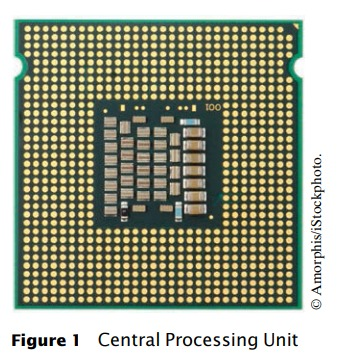

Ada dua macam penyimpanan. Penyimpanan utama, atau memori, dibuat dari sirkuit elektronik yang dapat menyimpan data, asalkan : disuplai dengan tenaga listrik. <b>Penyimpanan sekunder</b>, biasanya <b>hard disk</b> (lihat Gambar 2)atau solid-state drive, menyediakan penyimpanan yang lebih lambat dan lebih murah yang bertahan tanpa

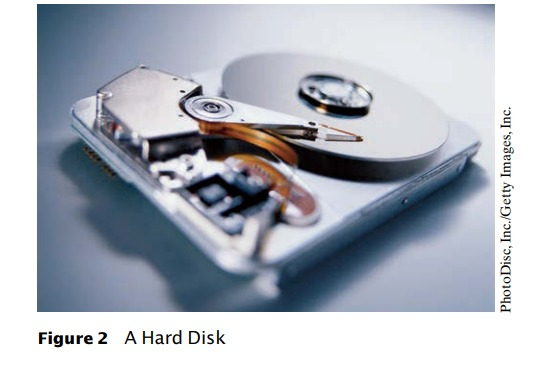

 <b>Chapter 1</b> Introduction

listrik. Sebuah hard disk terdiri dari piringan berputar, yang dilapisi dengan magnetnbahan. Solid-state drive menggunakan komponen elektronik yang dapat menyimpan informasitanpa daya, dan tanpa bagian yang bergerak.

Untuk berinteraksi dengan pengguna manusia, komputer membutuhkan perangkat periferal. Komputer mentransmisikan informasi (disebut output) kepada pengguna melalui layar tampilan, speaker, dan printer. Pengguna dapat memasukkan informasi (disebut input) untuk komputerdengan menggunakan keyboard atau alat penunjuk seperti mouse.

Beberapa komputer adalah unit mandiri, sedangkan yang lain saling berhubungan melalui <b>jaringan</b>. Melalui kabel jaringan, komputer dapat membaca data dan program dari lokasi penyimpanan pusat atau mengirim data ke komputer lain. Untuk penggunadari komputer jaringan, bahkan mungkin tidak jelas data mana yang berada di komputeritu sendiri dan yang ditransmisikan melalui jaringan.

Gambar 3 memberikan gambaran skematis arsitektur komputer pribadi.
Instruksi dan data program (seperti teks, angka, audio, atau video) berada di sekunder penyimpanan atau di tempat lain di jaringan. Ketika sebuah program dimulai, instruksinyadibawa ke memori, di mana CPU dapat membacanya. CPU membaca dan mengeksekusi satu instruksi pada suatu waktu. Seperti yang diarahkan oleh instruksi ini, CPU membacadata, memodifikasinya, dan menulisnya kembali ke memori atau penyimpanan sekunder. Beberapa programinstruksi akan menyebabkan CPU menempatkan titik-titik pada layar tampilan atau printer atau kegetaran speakernya. Karena tindakan ini terjadi berkali-kali dan dengan kecepatan tinggi,pengguna manusia akan melihat gambar dan suara. Beberapa instruksi program membaca penggunamasukan dari keyboard, mouse, sensor sentuh, atau mikrofon. Analisis programsifat input ini dan kemudian mengeksekusi instruksi yang sesuai berikutnya.

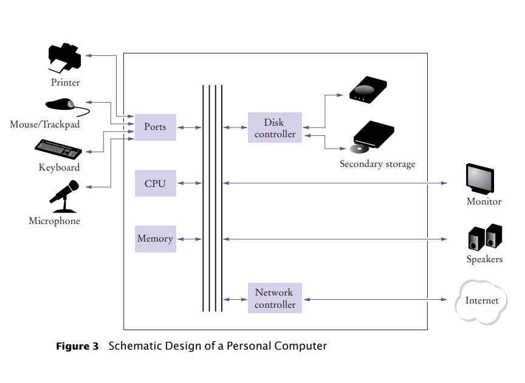

1.2 Anatomi Komputer

4. Di mana program disimpan saat sedang tidak berjalan?

5. Bagian komputer mana yang melakukan operasi aritmatika, seperti penjumlahan dan perkalian?

6. Smartphone modern adalah komputer, sebanding dengan komputer desktop. Komponen smartphone sesuai dengan yang ditunjukkan pada Gambar 3?

**Berlatih Sekarang** Anda dapat mencoba latihan ini di akhir bab: R1.2, R1.3.

## **Komputasi & Masyarakat** 1.1 Komputer Ada Dimana-mana

Ketika komputer pertama kali ditemukan pada tahun 1940-an, sebuah komputer mengisi seluruh ruangan. Foto di bawah ini menunjukkanENIAC (integrator numerik elektronik dan komputer), selesai dalam 1946 di Universitas Pennsylvania. ENIAC digunakan oleh militer untuk menghitung lintasan peluru. Saat ini, fasilitas komputasi mesin pencari, toko internet, danjejaringsosial memenuhi gedung-gedung besar disebut pusat data. Di ujung lain spektrum, komputer ada di mana-mana kita. Ponsel Anda memiliki komputer di dalam, seperti halnya banyak kartu kredit dan ongkos kartu untuk angkutan umum. Sebuah mobil modern memiliki beberapa komputer––untuk mengontrol mesin, rem, lampu, dan radio.

Munculnya komputasi di mana-mana mengubah banyak aspek dari hidup kami. Pabrik digunakan mempekerjakan orang untuk lakukan perakitan berulang tugas hari ini dilakukan oleh robot yang dikendalikan komputer, dioperasikan oleh beberapa orang yang tahu cara bekerja
dengan komputer-komputer itu. Buku, musik, dan film saat ini sering dikonsumsi di komputer, dan komputer hampir selalu terlibat dalam produksi mereka. Buku yang kamu baca sekarang tidak dapat ditulis tanpa komputer.

Mengetahui tentang komputer dan bagaimana memprogram mereka telah menjadi keterampilan penting dalam banyak karir. Insinyur merancang komputer yang dikendalikan mobil dan peralatan medis yang melestarikan kehidupan. Ilmuwan komputer mengembangkan program yang membantu orang berkumpul untuk mendukung sosial penyebab. Misalnya, aktivis menggunakan jejaring sosial untuk berbagi video menunjukkan penyalahgunaan oleh rezim represif,
dan informasi ini sangat penting dalam mengubah opini publik. Sebagai komputer, besar dan kecil, menjadi semakin tertanam dalam kami kehidupan sehari-hari, semakin penting bagi setiap orang untuk memahami caranya mereka bekerja, dan bagaimana bekerja dengan mereka.
Saat Anda menggunakan buku ini untuk mempelajari caranya memprogram komputer, Anda akan mengembangkan pemahaman yang baik tentang komputasi dasar yang akan membuat Anda warga negara yang lebih berpengetahuan dan, mungkin, seorang profesional komputasi.

 

**Bagian 1** Pengenalan

# **1.3 Bahasa Pemrograman Java**

Untuk menulis program komputer, Anda perlu memberikan urutan instruksi yang dapat dijalankan oleh CPU. Sebuah program komputer terdiri dari sejumlah besar instruksi CPU, dan itu membosankan dan rawan kesalahan untuk menentukannya satu per satu. Untuk Oleh karena itu, <b>bahasa pemrograman tingkat tinggi</b> telah dibuat. Dalam tingkat tinggi
bahasa, Anda menentukan tindakan yang harus dilakukan program Anda. <b>Kompilator</b> menerjemahkan instruksi tingkat tinggi ke dalam instruksi yang lebih rinci (disebut <b>kode mesin</b>) yang dibutuhkan oleh CPU. Banyak bahasa pemrograman yang berbeda memiliki telah dirancang untuk tujuan yang berbeda.

Pada tahun 1991, sebuah grup yang dipimpin oleh James Gosling dan Patrick Naughton di Sun Microsystems
merancang bahasa pemrograman, dengan nama kode "Green", untuk digunakan di konsumen
perangkat, seperti kotak "set-top" televisi cerdas. Bahasa itu dirancang untuk
sederhana, aman, dan dapat digunakan untuk berbagai jenis prosesor. Tidak ada pelanggan
pernah ditemukan untuk teknologi ini.

Gosling menceritakan bahwa pada tahun 1994 tim menyadari,
“Kita bisa menulis browser yang sangat keren. Itu satu dari beberapa hal dalam arus utama klien/server
yang membutuhkan beberapa hal aneh yang telah kami lakukan: arsitektur netral, real-time, andal, aman.” Java diperkenalkan kepada orang banyak yang antusias di
pameran SunWorld pada tahun 1995, bersama dengan sebuah browser yang menjalankan <b>applet</b>—kode Java yang dapat terletak di mana saja di Internet. Sosok di
kanan menunjukkan contoh khas applet.

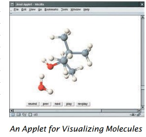

Sejak itu, Java tumbuh dengan kecepatan yang fenomenal.
Pemrogram telah memeluk bahasa ini karena
lebih mudah digunakan daripada saingan terdekatnya, C++. Selain itu, Java memiliki <b>perpustakaan</b> yang kaya yang
memungkinkan untuk menulis program portabel yang dapat melewati operasi berpemilik
sistem—fitur yang sangat dicari oleh mereka yang ingin mandiri
dari sistem berpemilik itu dan diperjuangkan dengan sengit oleh vendor mereka. "Edisi mikro" dan "edisi perusahaan" dari perpustakaan Java memungkinkan pemrogram Java untuk menargetkan
perangkat keras mulai dari kartu pintar hingga server Internet terbesar.

Karena Java dirancang untuk Internet, ia memiliki dua atribut yang membuatnya sangat
cocok untuk pemula: keamanan dan portabilitas.

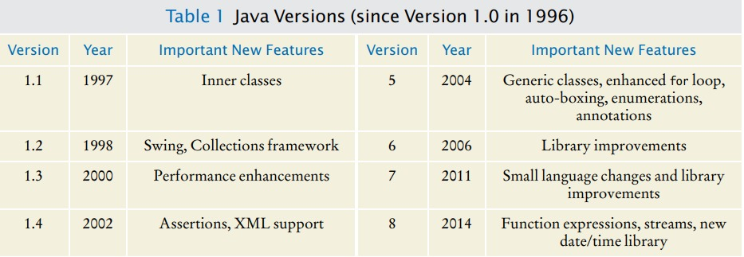

1.4 Menjadi Familiar dengan Lingkungan Pemrograman Anda

Java dirancang agar siapa pun dapat menjalankan program di browser mereka tanpa
takut. Fitur keamanan bahasa Java memastikan bahwa suatu program dihentikan jika:
mencoba melakukan sesuatu yang tidak aman. Memiliki lingkungan yang aman juga bermanfaat bagi siapa saja
belajar bahasa jawa. Saat Anda membuat kesalahan yang mengakibatkan perilaku tidak aman, program Anda
dihentikan dan Anda menerima laporan kesalahan yang akurat.

Manfaat lain dari Java adalah portabilitas. Program Java yang sama akan berjalan, tanpa
ubah, di Windows, UNIX, Linux, atau Macintosh. Untuk mencapai portabilitas,
compiler Java tidak menerjemahkan program Java secara langsung ke dalam instruksi CPU.
Sebaliknya, program Java yang dikompilasi berisi instruksi untuk <b>mesin virtual</b> Java,
sebuah program yang mensimulasikan CPU nyata. Portabilitas adalah manfaat lain untuk permulaan
murid. Anda tidak perlu belajar bagaimana menulis program untuk platform yang berbeda.

Saat ini, Java telah ditetapkan sebagai salah satu bahasa yang paling penting untuk
pemrograman tujuan umum serta untuk instruksi ilmu komputer. Namun,
meskipun Java adalah bahasa yang baik untuk pemula, itu tidak sempurna, karena tiga alasan.

Karena Java tidak dirancang khusus untuk siswa, tidak ada pemikiran yang diberikan untuk
membuatnya sangat sederhana untuk menulis program dasar. Sejumlah mesin teknis tertentu diperlukan untuk menulis bahkan program yang paling sederhana. Ini bukan masalah bagi programmer profesional, tetapi bisa menjadi gangguan bagi siswa pemula. Saat Anda belajar
cara memprogram di java, akan ada saatnya anda akan diminta untuk puas
penjelasan awal dan tunggu detail lebih lengkapnya di bab selanjutnya.

Java telah diperpanjang berkali-kali selama hidupnya—lihat Tabel 1. Dalam buku ini, kami asumsikan Anda memiliki Java versi 7 atau yang lebih baru.

Akhirnya, Anda tidak dapat berharap untuk mempelajari semua bahasa Jawa dalam satu kursus. Bahasa Jawa itu sendiri
relatif sederhana, tetapi Java berisi sekumpulan besar paket perpustakaan yang diperlukan
untuk menulis program yang bermanfaat. Ada paket untuk grafis, desain antarmuka pengguna,
kriptografi, jaringan, suara, penyimpanan database, dan banyak tujuan lainnya. Bahkan
programmer Java ahli tidak dapat berharap untuk mengetahui isi dari semua paket—
mereka hanya menggunakan yang mereka butuhkan untuk proyek tertentu.

Dengan menggunakan buku ini, Anda diharapkan dapat belajar banyak tentang bahasa Jawa
dan tentang paket yang paling penting. Ingatlah bahwa tujuan utama dari ini
Buku itu bukan untuk membuatmu menghafalkan hal-hal kecil Java, tapi untuk mengajarimu cara berpikir
tentang pemrograman.

7. Apa dua manfaat terpenting dari bahasa Java?

8. Berapa lama waktu yang dibutuhkan untuk mempelajari seluruh perpustakaan Java?

**Berlatih Sekarang** Anda dapat mencoba latihan ini di akhir bab: R1.5

# 1.4 **Menjadi Familiar dengan Lingkungan Pemrograman Anda**

Banyak siswa menemukan bahwa alat yang mereka butuhkan sebagai programmer sangat berbeda dari perangkat lunak yang mereka kenal. Anda harus meluangkan waktu untuk membiasakan diri dengan lingkungan pemrograman Anda. Karena sistem komputer bervariasi secara luas, buku ini hanya dapat memberikan garis besar langkah-langkah yang perlu Anda ikuti. Ini bagus ide untuk berpartisipasi dalam lab langsung, atau meminta teman yang berpengetahuan luas untuk memberi Anda tur.

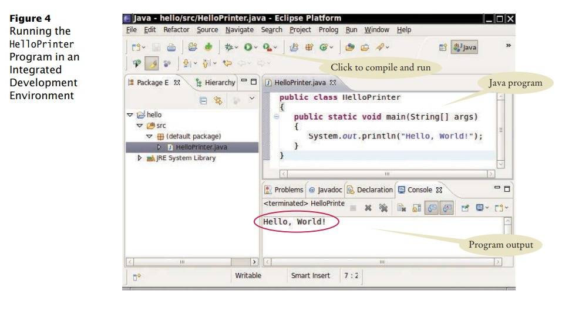

**Langkah 1** Mulai lingkungan pengembangan Java.

Sistem komputer sangat berbeda dalam hal ini. Pada banyak komputer terdapat lingkungan pengembangan terpadu di mana Anda dapat menulis dan menguji program Anda.
Di komputer lain Anda pertama kali meluncurkan <b>editor</b>, program yang berfungsi seperti kata
prosesor, di mana Anda dapat memasukkan instruksi Java Anda; Anda kemudian membuka konsol
jendela dan ketik perintah untuk menjalankan program Anda. Anda perlu mencari tahu caranya
mulailah dengan lingkungan Anda.

**Langkah 2** Tulis program sederhana.

Pilihan tradisional untuk program pertama dalam bahasa pemrograman baru adalah sebuah program yang menampilkan sapaan sederhana: “Hello, World!”. Mari kita ikuti tradisi itu. Inilah "Hello, World!" program di java

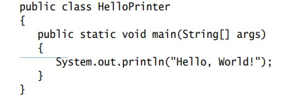

Kami akan memeriksa program ini di bagian selanjutnya.

Apa pun lingkungan pemrograman yang Anda gunakan, Anda memulai aktivitas dengan
mengetik pernyataan program ke dalam jendela editor.

Buat file baru dan beri nama HelloPrinter.java, menggunakan langkah-langkah yang sesuai
untuk lingkungan Anda. (Jika lingkungan Anda mengharuskan Anda memberikan nama proyek
selain nama file, gunakan nama hello untuk proyek tersebut.) Masuk ke program
instruksi persis seperti yang diberikan di atas. Atau, cari salinan elektroniknya
dalam kode pendamping buku ini dan tempelkan ke editor Anda.

# 1.4 Menjadi Familiar dengan Lingkungan Pemrograman Anda

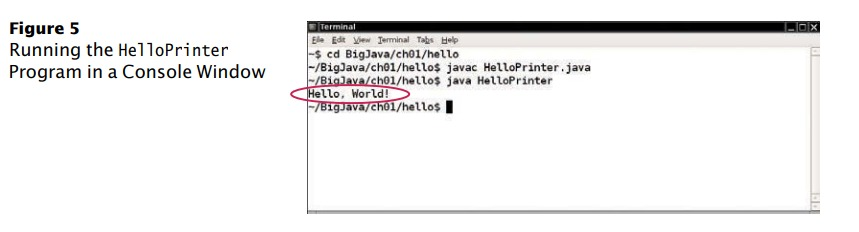

Saat Anda menulis program ini, perhatikan baik-baik berbagai simbol, dan ingat bahwa Java <b>peka huruf besar-kecil</b>. Anda harus memasukkan huruf besar dan kecil dengan tepat seperti yang muncul dalam daftar program. Anda tidak dapat mengetik MAIN atau PrintLn. Jika Anda tidak
hati-hati, Anda akan mengalami masalah—lihat Kesalahan Umum 1.2 di halaman 15.

**Langkah 3** Jalankan Program

Proses untuk menjalankan program sangat bergantung pada lingkungan pemrograman Anda. Anda mungkin harus mengklik tombol atau memasukkan beberapa perintah. Saat Anda menjalankan program uji, pesannya

akan muncul di suatu tempat di layar (lihat Gambar 4 dan 5).

Untuk menjalankan program Anda, kompiler Java menerjemahkan file sumber Anda (yang
adalah, pernyataan yang Anda tulis) ke dalam <b>file kelas</b>. (File kelas berisi instruksi untuk
mesin virtual Java.) Setelah kompiler menerjemahkan <b>kode sumber</b> Anda ke dalam
instruksi mesin virtual, mesin virtual mengeksekusinya. Selama eksekusi,
mesin virtual mengakses perpustakaan kode pra-tertulis, termasuk implementasi kelas System dan PrintStream yang diperlukan untuk menampilkan output program. Gambar 6 merangkum proses membuat dan menjalankan program Java. Di beberapa lingkungan pemrograman, kompiler dan mesin virtual adalah
pada dasarnya tidak terlihat oleh programmer — mereka secara otomatis dieksekusi kapan saja
Anda meminta untuk menjalankan program Java. Di lingkungan lain, Anda perlu meluncurkan kompiler dan mesin virtual secara eksplisit.

**Langkah 4**  Atur pekerjaan Anda.

Sebagai seorang programmer, Anda menulis program, mencobanya, dan memperbaikinya. Anda menyimpan
program Anda dalam <b>file</b>. File disimpan dalam <b>folder</b> atau <b>direktori</b>. Sebuah folder dapat berisi

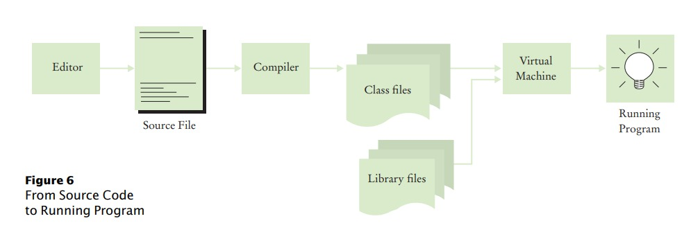

**Bagian 1** Pengenalan

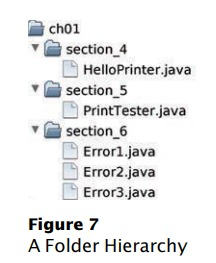

file serta folder lain, yang dengan sendirinya dapat berisi lebih banyak file dan folder (lihat
Gambar 7). Hirarki ini bisa sangat besar, dan Anda tidak perlu khawatir dengan semuanya
cabang-cabangnya. Namun, Anda harus membuat folder untuk mengatur pekerjaan Anda. Ini adalah sebuah
ide bagus untuk membuat folder terpisah untuk kursus pemrograman Anda. Di dalam itu
folder, buat folder tersendiri untuk setiap program.

Beberapa lingkungan pemrograman menempatkan program Anda ke lokasi default jika
Anda tidak menentukan folder sendiri. Dalam hal ini, Anda perlu mencari tahu di mana file-file itu
berada.

Pastikan Anda memahami di mana file Anda berada dalam hierarki folder.
Informasi ini penting saat Anda mengirimkan file untuk penilaian, dan untuk pembuatan
salinan cadangan (lihat Tip Pemrograman 1.1).

9. Di mana file HelloPrinter.java disimpan di komputer Anda?
10. Apa yang Anda lakukan untuk melindungi diri Anda dari kehilangan data saat Anda mengerjakan proyek pemrograman?

**Berlatih Sekarang** Anda dapat mencoba latihan ini di akhir bab: R1.6.

### **Tips Pemrograman 1.1**

### **Salinan Caangan**

Anda akan menghabiskan banyak waktu untuk membuat dan meningkatkan program Java. Dia
mudah menghapus file secara tidak sengaja, dan terkadang file hilang karena
dari kerusakan komputer. Mengetik ulang konten file yang hilang membuat frustrasi dan memakan waktu. Oleh karena itu sangat penting bahwa
Anda belajar cara mengamankan file dan membiasakan diri melakukannya sebelumnya
bencana melanda. Mencadangkan file pada stik memori adalah metode penyimpanan yang mudah dan nyaman
untuk banyak orang. Bentuk cadangan lain yang semakin populer adalah penyimpanan file Internet. Di Sini
adalah beberapa petunjuk yang perlu diingat:

- _Sering-seringlah membuat cadangan_. Mencadangkan file hanya membutuhkan beberapa detik, dan
kamu akan membenci dirimu sendiri jika harus menghabiskan waktu berjam-jam
menciptakan kembali pekerjaan yang bisa Anda simpan dengan mudah. saya merekomendasi
bahwa Anda membuat cadangan pekerjaan Anda setiap tiga puluh menit sekali.
- _Putar cadangan_. Gunakan lebih dari satu direktori untuk cadangan, dan putar mereka. Yaitu, pertama
kembali ke direktori pertama. Kemudian kembali ke direktori kedua. Kemudian gunakan
ketiga, dan kemudian kembali ke yang pertama. Dengan begitu Anda selalu memiliki tiga cadangan terbaru. Jika
perubahan terbaru Anda memperburuk keadaan, Anda kemudian dapat kembali ke versi yang lebih lama.
- _Perhatikan arah pencadangan_. Pencadangan melibatkan penyalinan file dari satu tempat ke
lain. Anda harus melakukannya dengan benar—yaitu, menyalin dari lokasi kerja Anda ke
lokasi cadangan. Jika Anda melakukannya dengan cara yang salah, Anda akan menimpa file yang lebih baru dengan
versi yang lebih lama.
- _Periksa cadangan Anda sesekali_. Periksa kembali apakah cadangan Anda berada di tempat yang Anda pikirkan
mereka. Tidak ada yang lebih membuat frustrasi daripada mengetahui bahwa cadangan tidak ada
ketika Anda membutuhkan mereka.
- _Santai, lalu pulihkan_. Saat Anda kehilangan file dan perlu memulihkannya dari cadangan, Anda
mungkin dalam keadaan tidak bahagia dan gugup. Ambil napas dalam-dalam dan pikirkan baik-baik
proses pemulihan sebelum Anda mulai. Bukan hal yang aneh bagi pengguna komputer yang gelisah untuk
hapus cadangan terakhir saat mencoba memulihkan file yang rusak.

# 1.5 Menganalisis Program Pertama 

 

Pada bagian ini, kita akan menganalisis program Java pertama secara rinci. Di sini lagi adalah
sumber kode :

garis

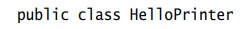

menunjukkan deklarasi <b>kelas</b> yang disebut HelloPrinter.

Setiap program Java terdiri dari satu atau lebih kelas. Kami akan membahas kelas lebih lanjut
rinci dalam Bab 2 dan 3.

Kata publik menunjukkan bahwa kelas dapat digunakan oleh "publik". Anda akan nanti
menemukan fitur pribadi.

Di Java, setiap file sumber dapat berisi paling banyak satu kelas publik, dan nama dari kelas publik harus cocok dengan nama file yang berisi kelas tersebut. Misalnya, kelas HelloPrinter harus terdapat dalam sebuah file bernama HelloPrinter.java.

Konstruksi

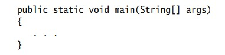

mendeklarasikan <b>metode</b> yang disebut main. Sebuah metode berisi kumpulan pemrograman
instruksi yang menjelaskan bagaimana melaksanakan tugas tertentu. Setiap aplikasi Java
harus memiliki <b>metode utama</b>. Sebagian besar program Java berisi metode lain selain utama,
dan Anda akan melihat di Bab 3 cara menulis metode lain.

Istilah statis dijelaskan secara lebih rinci dalam Bab 8, dan arti dari
String[] args dibahas dalam Bab 11. Saat ini, cukup pertimbangkan

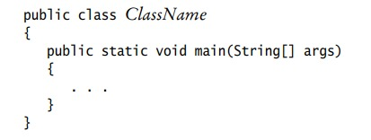

sebagai bagian dari "pipa" yang diperlukan untuk membuat program Java. Program pertama kami memiliki semua instruksi di dalam metode utama kelas.

Metode utama berisi satu atau lebih instruksi yang disebut <b>pernyataan</b>. Setiap statemen diakhiri dengan titik koma (;). Ketika sebuah program berjalan, pernyataan dalam metode utama dijalankan satu per satu.

**Bagian 1** Pengenalan

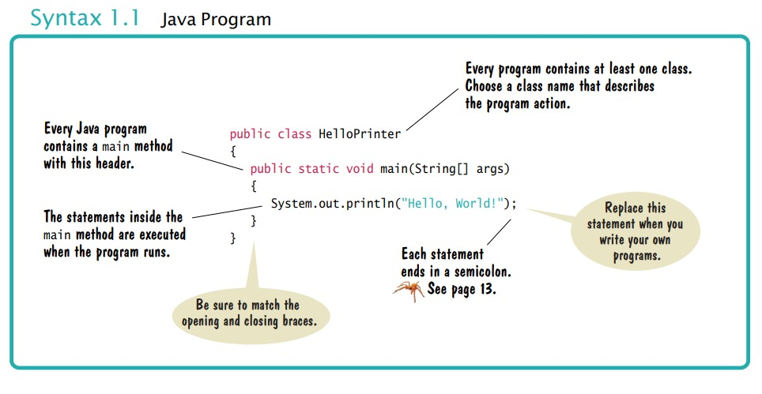

Dalam program contoh kami, metode utama memiliki satu pernyataan:

System.out.println("Hello, World!");

Pernyataan ini mencetak sebaris teks, yaitu “Hello, World!”. Dalam pernyataan ini, kami menyebut metode yang, untuk alasan yang tidak akan kami jelaskan di sini, ditentukan oleh
nama panjang System.out.println.

Kita tidak harus mengimplementasikan metode ini—programmer yang menulis Java
perpustakaan sudah melakukannya untuk kita. Kami hanya ingin metode untuk melakukan yang dimaksudkan
tugas, yaitu mencetak nilai.
Setiap kali Anda memanggil metode di Java, Anda perlu menentukan

1. Metode yang ingin Anda gunakan (dalam hal ini, System.out.println).
2. Nilai apa pun yang dibutuhkan metode untuk menjalankan tugasnya (dalam hal ini, "Hello, World!").
Istilah teknis untuk nilai seperti itu adalah argumen. Argumen terlampir dalam
tanda kurung. Beberapa argumen dipisahkan dengan koma.

Urutan karakter yang diapit tanda kutip

"Hello, World!"

disebut <b>string</b>. Anda harus menyertakan isi string di dalam tanda kutip
sehingga kompiler mengetahui maksud Anda secara harfiah "Halo, Dunia!". Ada alasan untuk
persyaratan ini. Misalkan Anda perlu mencetak kata main. Dengan melampirkannya dalam tanda kutip, "utama", kompiler tahu maksud Anda urutan karakter m a i n,
bukan metode bernama main. Aturannya sederhana, Anda harus menyertakan semua string teks
dalam tanda kutip, sehingga kompiler menganggapnya sebagai teks biasa dan tidak mencoba
menafsirkannya sebagai instruksi program.

Anda juga dapat mencetak nilai numerik. Misalnya, pernyataan

System.out.println(3 + 4);

mengevaluasi ekspresi 3 + 4 dan menampilkan angka 7.
 
 

1.5 Menganalisis Program Pertama Anda

Metode System.out.println mencetak string atau angka dan kemudian memulai yang baru garis. Misalnya, urutan pernyataan

System.out.println("Hello");

System.out.println("World!");

mencetak dua baris teks:

Hello

World!

Ada metode kedua, System.out.print, yang dapat Anda gunakan untuk mencetak item tanpa
memulai baris baru. Misalnya, output dari dua pernyataan

System.out.print("00");

System.out.println(3 + 4);

adalah garis tunggal

007

11. Bagaimana Anda memodifikasi program HelloPrinter untuk menyambut Anda?
12. Bagaimana cara memodifikasi program HelloPrinter untuk mencetak kata “Halo”
Tegak lurus?
13. Apakah program akan terus bekerja jika Anda mengganti baris 7 dengan pernyataan ini?

System.out.println(Halo);

14. Apa yang dicetak oleh kumpulan pernyataan berikut?

System.out.print("Angka keberuntungan saya adalah");

System.out.println(3 + 4 + 5);

15. Apa yang dicetak oleh pernyataan berikut?

System.out.println("Halo");

System.out.println("");

System.out.println("Dunia");

**Berlatih Sekarang** Anda dapat mencoba latihan ini di akhir bab: R1.7, R1.8, E1.5, E1.8.
 
 

### **Kesalahan Umum 1.1**

**Menghilangkan Titik Koma**

Di Java setiap pernyataan harus diakhiri dengan titik koma. Lupa mengetik titik koma adalah hal biasa
kesalahan. Ini membingungkan kompiler, karena kompiler menggunakan titik koma untuk menemukan di mana satu
pernyataan berakhir dan yang berikutnya dimulai. Kompiler tidak menggunakan jeda baris atau kurung kurawal
untuk mengenali akhir pernyataan. Misalnya, kompiler menganggap

System.out.println("Hello")

System.out.println("World!");

satu pernyataan, seolah-olah Anda telah menulis

System.out.println("Hello") System.out.println("World!");

Kemudian tidak mengerti pernyataan itu, karena tidak mengharapkan kata Sistem mengikuti kurung penutup setelah "Hello".

Obatnya sederhana. Pindai setiap pernyataan untuk tanda titik koma, seperti yang Anda lakukan
periksa apakah setiap kalimat bahasa Inggris diakhiri dengan tanda titik. Namun, jangan tambahkan titik koma di
akhir kelas publik Halo atau public static void main. Garis-garis ini bukan pernyataan.

# 1.6 Kesalahan

Bereksperimenlah sedikit dengan program Hello Printer. Apa yang terjadi jika Anda membuat kesalahan pengetikan seperti

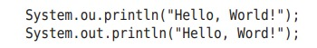
 

Dalam kasus pertama, kompiler akan mengeluh. Kompiler akan mengatakan bahwa ia tidak tahu apa yang Anda maksud dengan ou. Kata-kata yang tepat dari pesan kesalahan tergantung pada lingkungan pengembangan Anda, tetapi mungkin seperti "Tidak dapat menemukan simbol ou". Ini adalah kesalahan waktu-kompilasi. Ada yang salah menurut aturan bahasa dan kompiler menemukannya. Untuk alasan ini, kesalahan waktu kompilasi sering disebut kesalahan sintaksis. Ketika kompilator menemukan satu atau lebih kesalahan, ia menolak untuk menerjemahkan program kedalam instruksi mesin virtual Java, dan sebagai konsekuensinya Anda tidak memiliki program yang dapat dijalankan. Anda harus memperbaiki kesalahan dan mengkompilasi lagi. Faktanya, kompilator cukup pilih-pilih, dan adalah umum untuk melewati beberapa putaran memperbaiki kesalahan waktu kompilasi sebelum kompilasi berhasil untuk pertama kalinya.

**Bagian 1** Pengenalan

Jika kompiler menemukan kesalahan, itu tidak akan berhenti dan menyerah begitu saja. Kompiler akan mencoba melaporkan kesalahan sebanyak yang dapat ditemukan, sehingga Anda dapat memperbaiki semuanya sekaligus.

Pemrograman menghabiskan cukup banyak
waktu memperbaiki waktu kompilasi dan kesalahan runtime

Terkadang, kesalahan membuat kompiler keluar jalur. Misalkan, misalnya, Anda lupa tanda kutip di sekitar string: System.out.println(Hello, World!).Kompiler tidak akan mengeluh tentang tanda kutip yang hilang. Sebagai gantinya, kompiler akan melaporkan "Tidak dapat menemukan simbol Hello". Sayangnya, kompilernya tidak terlalu pintar dan tidak menyadari bahwa Anda bermaksud menggunakan string. Terserah Anda untuk menyadari bahwa Anda perlu menyertakan string dalam tanda kutip. 

Kesalahan pada baris kedua di atas adalah jenis yang berbeda. Program akan dikompilasi dan dijalankan, tetapi output nya akan salah. Ini akan mencetak
Hello, Word! 

Ini adalah <b>kesalahan run-time</b>. Program ini secara sintaksis benar dan melakukan sesuatu,tetapi tidak melakukan apa yang seharusnya dilakukan. Karena kesalahan run-time disebabkan oleh kelemahan logis dalam program, mereka sering disebut <b>kesalahan logika</b>. 

Kesalahan run-time khusus ini tidak menyertakan pesan kesalahan. Itu hanya menghasilkan output yang salah. Beberapa jenis kesalahan run-time sangat parah sehingga menghasilkan <b>pengecualian</b>: pesan kesalahan dari mesin virtual Java. Misalnya, jika program Anda menyertakan pernyataan 

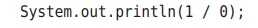

Anda akan mendapatkan pesan kesalahan run-time "Pembagian dengan nol".

Selama pengembangan program, kesalahan tidak dapat dihindari. Begitu sebuah program lebih panjang dari beberapa baris, itu akan membutuhkan konsentrasi manusia super untuk memasukkannya dengan benar tanpa tergelincir satu kali pun. Anda akan menemukan diri Anda menghilangkan titik koma atau tanda kutip lebih sering dari pada yang Anda inginkan, tetapi kompilator akan melacak masalah ini untuk Anda.

Kesalahan run-time lebih merepotkan. Kompilator tidak akan menemukannya—sebenarnya, kompilator akan dengan senang hati menerjemahkan program apa pun selama sintaks nya benar—tetapi program yang dihasilkan akan melakukan kesalahan. Ini adalah tanggung jawab pembuat program untuk menguji program dan menemukan kesalahan run-time. 

### **Kesalahan Umum 1.2**

### **Kata-kata yang salah eja**

Jika Anda secara tidak sengaja salah mengeja kata, maka hal-hal aneh mungkin terjadi, dan itu mungkin tidak selalu
benar-benar jelas dari pesan kesalahan apa yang salah. Berikut adalah contoh yang bagus tentang caranya
kesalahan ejaan sederhana dapat menyebabkan masalah:

1.7 Pemecahan Masalah: Desain Algoritma

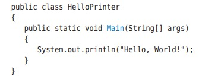

Kelas ini mendeklarasikan sebuah metode yang disebut Main. Kompiler tidak akan menganggap ini sama dengan
metode main, karena Main dimulai dengan huruf besar dan bahasa Java peka huruf besar-kecil. Huruf besar dan huruf kecil dianggap benar-benar berbeda satu sama lain,
dan untuk kompiler Main tidak lebih cocok untuk main daripada rain. Kompiler akan dengan senang hati
kompilasi metode Utama Anda, tetapi ketika mesin virtual Java membaca file yang dikompilasi, itu akan
mengeluh tentang metode utama yang hilang dan menolak untuk menjalankan program. Tentu saja, pesan "metode utama yang hilang" akan memberi Anda petunjuk di mana mencari kesalahan.

Jika Anda mendapatkan pesan kesalahan yang tampaknya menunjukkan bahwa kompiler atau mesin virtual aktif
trek yang salah, periksa ejaan dan kapitalisasi. Jika Anda salah mengeja nama simbol
(misalnya, ou alih-alih keluar), kompiler akan menghasilkan pesan seperti "tidak dapat menemukan sym bol ou". Pesan kesalahan itu biasanya merupakan petunjuk bagus bahwa Anda membuat kesalahan ejaan.

# **1.7 Pemecahan Masalah: Desain Algoritma**

Anda akan segera belajar bagaimana memprogram perhitungan dan pengambilan keputusan di Java. Tetapi sebelum kita melihat mekanisme penerapan perhitungan di bab berikutnya, mari kita pertimbangkan bagaimana Anda dapat menjelaskan langkah-langkah yang diperlukan untuk menemukan solusi dari suatu masalah. 

## 1.7.1 Konsep Algoritma

Menemukan pasangan yang sempurna bukanlah
masalah yang dapat dipecahkan oleh komputer.

Anda mungkin telah menemukan iklan yang mendorong Anda untuk membayar layanan terkomputerisasi mencocokkan Anda dengan pasangan cinta. Memikirkan bagaimana ini bisa berhasil. Anda mengisi formulir dan kirimkan. Yang lain melakukan hal yang sama. Data diproses oleh program komputer. Apakah masuk akal untuk asumsikan bahwa komputer dapat melakukan tugasmenemukan pasangan terbaik untuk Anda? Misalkan Anda adik laki-laki, bukan komputer, memiliki semua formulir di mejanya. Instruksi apa yang bisa Anda berikan? memberinya? Anda tidak bisa mengatakan, “Temukan yang paling tampan orang yang suka inline skating dan browsing internet”. Tidak ada standar objektif untuk ketampanan, dan pendapat saudaramu (atau itu program komputer yang menganalisis foto calon mitra) kemungkinan akan berbeda dari milik Anda. Jika Anda tidak dapat memberikan instruksi tertulis kepada seseorang untuk menyelesaikannya masalah, tidak mungkin komputer secara ajaib dapat menemukan solusi yang tepat. Itu komputer hanya dapat melakukan apa yang Anda perintahkan. Itu hanya melakukannya lebih cepat, tanpa mendapatkan bosan atau lelah. 

**Bagian 1** Pengenalan

Oleh karena itu, layanan pembuatan jodoh yang terkomputerisasi tidak dapat menjamin untuk menemukanpasangan yang optimal untuk Anda. Sebagai gantinya, Anda mungkin disajikan dengan serangkaian calon mitra yang memiliki minat yang sama dengan Anda. Itu adalah tugas yang program computer dapat memecahkan. 

Agar program komputer memberikan jawaban atas masalah yang menghitung jawaban, itu harus mengikuti urutan langkah-langkah yang

- Jelas

- Dapat dijalankan

- Mengakhiri

Urutan langkah tidak ambigu ketika ada instruksi yang tepat tentang apa yang harus dilakukan pada setiap langkah dan kemana harus pergi selanjutnya. Tidak ada ruang untuk menebak atau pendapat pribadi. Sebuah langkah dapat dieksekusi ketika itu dapat dilaksanakan dalam praktek. Misalnya, komputer dapat mencantumkan semua orang yang memiliki hobi yang sama dengan Anda, tapi itu tidak bisa memprediksi siapa yang akan menjadi pasangan seumur hidup Anda. Akhirnya, urutan langkah berakhir jika pada akhirnya akan berakhir. Sebuah program yang terus bekerja tanpa memberikan jawaban adalah jelas tidak berguna. 

Urutan langkah yang tidak ambigu, dapat dieksekusi, dan diakhiri disebut <b>algoritma</b>. Meskipun tidak ada algoritme untuk menemukan pasangan, banyak masalah memiliki algoritme untuk diselesaikan mereka. Bagian berikutnya memberikan contoh. 

Algoritma adalah resep untuk
menemukan solusi

## 1.7.2 Algoritma untuk Memecahkan Masalah Investasi

Pertimbangkan masalah investasi berikut:

<b>Anda memasukkan $10.000 ke dalam rekening bank yang menghasilkan bunga 5 persen per tahun. Berapa banyak tahun yang diperlukan agar saldo akun menjadi dua kali lipat dari aslinya? Bisakah Anda memecahkan masalah ini dengan tangan? Tentu, Anda bisa. Anda mengetahui keseimbangannya sebagai berikut:</b>

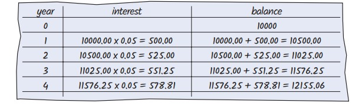<
Anda terus berjalan sampai saldo setidaknya $20.000. Kemudian angka terakhir di tahun inikolom adalah jawabannya. 

Tentu saja, melakukan perhitungan ini sangat membosankan bagi Anda atau Anda
adik laki-laki. Tetapi komputer sangat baik dalam melakukan perhitungan berulang dengan cepat dan tanpa cacat. Yang penting bagi komputer adalah deskripsi dari

1.7 Pemecahan Masalah: Desain Algoritma

langkah mencari solusi. Setiap langkah harus jelas dan tidak ambigu, tidak memerlukan
tebak-tebakan. Berikut adalah deskripsi seperti itu :

<b>Setel tahun ke 0, saldo ke 10.000.</b> 

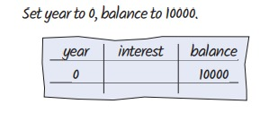

<b> Ketika saldo kurang dari $20,000</b>

<b>Tambahkan 1 ke tabel tahun.</b>

<b>Tetapkan bunga ke saldo x 0,05 (yaitu, bunga 5 persen).</b>

<b>Tambahkan bunga ke saldo </b>

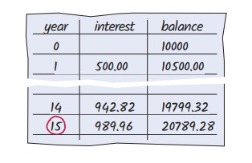

<b>Laporan tahun sebagai jawabannya.</b>

Langkah-langkah ini termasuk dalam bahasa yang belum dapat dipahami oleh komputer, tapi kamu akan segera belajar bagaimana merumuskannya dalam Java. Deskripsi ini disebut dengan pseudocode. Kami membahas aturan untuk menulis <b>pseudocode</b> di bagian selanjutnya. 

## 1.7.3 Pseudocode

Tidak ada persyaratan ketat untuk pseudocode karena dibaca oleh manusia,bukan program komputer. Berikut adalah jenis-jenis pernyataan pseudocode dan bagaimana kita akan menggunakan penerapannya dalam buku ini:

- Gunakan pernyataan seperti berikut ini untuk menjelaskan bagaimana suatu nilai ditetapkan atau diubah: 

<b>biaya total = harga beli + biaya operasi</b>

<b>Kalikan nilai saldo dengan 1,05.</b>

<b>Hapus karakter pertama dan terakhir dari kata.</b>

- Jelaskan keputusan dan pengulangan sebagai berikut:

<b>Jika total biaya 1 < total biaya 2</b>

<b>Ketika saldo kurang dari $20,000</b>

<b>Untuk setiap gambar dalam urutan</b>

Gunakan lekukan untuk menunjukkan pernyataan mana yang harus dipilih atau diulang:

<b>Untuk setiap mobil</b>

<b>biaya operasi = 10 x biaya bahan bakar tahunan</b>

<b>biaya total = harga beli + biaya operasi</b>

Di sini, lekukan menunjukkan bahwa kedua pernyataan harus dieksekusi untuk setiap mobil.

**Bagian 1** Pengenalan

- Tunjukkan hasil dengan pernyataan seperti:

<b>Pilih mobil1.</b>

<b>Laporkan tahun sebagai jawabannya.</b>

## 1.7.4 Dari Algoritma ke Program

Di Bagian 1.7.2, kami mengembangkan pseudocode untuk menemukan berapa lama waktu yang dibutuhkan untuk menggandakan investasi. Mari kita periksa kembali bahwa pseudocode mewakili suatu algoritma itu . adalah bahwa pseudocode itu jelas, dapat dieksekusi, dan diakhiri. 

Pseudocode kami jelas. Ini hanya memberi tahu cara memperbarui nilai di setiap langkah. Pseudocode dapat dieksekusi karena kami menggunakan tingkat bunga tetap. Apakah kami mengatakan untuk menggunakan tingkat bunga aktual yang akan dibebankan di tahun-tahun mendatang, dan bukan tingkat bunga tetap 5 persen per tahun, instruksi tidak akan dapat dieksekusi. Tidak ada jalan bagi siapa pun untuk mengetahui berapa tingkat bunga di masa depan. Ini membutuhkan sedikit berpikir untuk melihat bahwa langkah-langkahnya berakhir: Dengan setiap langkah, keseimbangan naik setidaknya $ 500, jadi akhirnya harus mencapai $ 20.000. 

Oleh karena itu, kami telah menemukan algoritme untuk menyelesaikan masalah investasi kami, dan kami tahu kami dapat menemukan solusinya dengan memprogram komputer. Keberadaan algoritma adalah prasyarat penting untuk memprogram tugas. Anda harus terlebih dahulu algoritma untuk tugas anda sebelum Anda memulai pemrograman (lihat Angka 8). Dalam bab-bab berikutnya, Anda akan mempelajari cara mengekspresikan algoritme dalam bahasa Java.

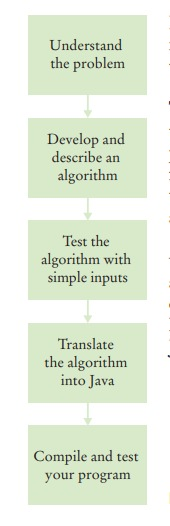

Gambar 8 Proses Pengembangan Perangkat Lunak

**BAGAIMANA 1.1**

**Menjelaskan Algoritma dengan Pseudocode**

Ini adalah bagian pertama dari banyak bagian "Cara" dalam buku ini yang memberi Anda prosedur langkah demi langkah untuk melaksanakan tugas-tugas penting dalam mengembangkan program komputer.

Sebelum Anda siap untuk menulis program di Java, Anda perlu mengembangkan algoritma—a
metode untuk sampai pada solusi untuk masalah tertentu. Jelaskan algoritme dalam kode semu—urutan langkah-langkah tepat yang diformulasikan dalam bahasa Inggris. Untuk mengilustrasikannya, kami akan merancang sebuah algo rithm untuk masalah ini:

<b>Pernyataan Masalah</b> Anda memiliki pilihan untuk membelinya
dari dua mobil. Yang satu lebih hemat bahan bakar dari yang lain, tapi juga
lebih mahal. Anda tahu harga dan efisiensi bahan bakar (dalam mil
per galon, mpg) dari kedua mobil. Anda berencana untuk menyimpan mobil selama sepuluh
bertahun-tahun. Asumsikan harga $4 per galon gas dan penggunaan 15.000
mil per tahun. Anda akan membayar tunai untuk mobil dan tidak khawatir tentang
biaya pembiayaan. Mobil mana yang lebih baik?

1.7 Pemecahan Masalah: Desain Algoritma

**Langkah 1** Tentukan input dan output.

Dalam contoh masalah kami, kami memiliki input ini:

- _harga beli1_ dan _efisiensi bahan bakar1_, harga dan efisiensi bahan bakar (dalam mpg) mobil pertama

- _harga beli2 dan efisiensi bahan bakar2_, harga dan efisiensi bahan bakar mobil kedua

Kami hanya ingin tahu mobil mana yang lebih baik dibeli. Itu adalah keluaran yang diinginkan.

**Langkah 2** Memecah masalah menjadi tugas-tugas yang lebih kecil.

Untuk setiap mobil, kita perlu mengetahui total biaya mengemudinya. Mari kita lakukan perhitungan ini secara terpisah
untuk setiap mobil. Setelah kami memiliki total biaya untuk setiap mobil, kami dapat memutuskan mobil mana yang lebih baik.

Total biaya untuk setiap mobil adalah harga _beli + biaya operasional_.

Kami mengasumsikan penggunaan konstan dan harga gas selama sepuluh tahun, sehingga biaya operasi tergantung pada
biaya mengemudi mobil selama satu tahun.

Biaya operasi adalah _10 x biaya bahan bakar tahunan_.
Biaya bahan bakar tahunan adalah _harga per galon x bahan bakar tahunan yang dikonsumsi_.

Bahan bakar tahunan yang dikonsumsi adalah <I>jarak tempuh tahunan / efisiensi bahan bakar</i>. Misalnya, jika Anda mengendarai mobil
untuk 15.000 mil dan efisiensi bahan bakar adalah 15 mil/galon, mobil mengkonsumsi 1.000 galon.

**Langkah 3** Jelaskan setiap subtugas dalam pseudocode.

Dalam deskripsi Anda, atur langkah-langkahnya sehingga setiap nilai antara dihitung sebelumnya
mereka diperlukan dalam perhitungan lain. Misalnya, daftar langkah

_biaya total = harga beli + biaya operasi_

setelah Anda menghitung _biaya operasi_.
Berikut adalah algoritma untuk memutuskan mobil mana yang akan dibeli:

_Untuk setiap mobil, hitung total biaya sebagai berikut:_

_konsumsi bahan bakar tahunan = jarak tempuh tahunan / efisiensi bahan bakar_

_biaya bahan bakar tahunan = harga per galon x bahan bakar tahunan yang dikonsumsi_

_biaya operasi = 10 x biaya bahan bakar tahunan_
_biaya total = harga beli + biaya operasi_

_Jika total biaya mobil1 < total biaya mobil2_

_Pilih mobil1._

_Kalau tidak_

_Pilih mobil2._

**Langkah 4** Uji pseudocode Anda dengan mengerjakan soal.

Kami akan menggunakan nilai sampel ini:

Mobil 1: $25.000, 50 mil/galon

Mobil 2: $20,000, 30 mil/galon

Berikut adalah perhitungan untuk biaya mobil pertama:

_konsumsi bahan bakar tahunan = jarak tempuh tahunan / efisiensi bahan bakar = 15000 / 50 = 300_

_biaya bahan bakar tahunan = harga per galon x konsumsi bahan bakar tahunan = 4 x 300 = 1200_

_biaya operasi = 10 x biaya bahan bakar tahunan = 10 x 1200 = 12000_

_total biaya = harga beli + biaya operasi = 25000 + 12000 = 37000_

Demikian pula, total biaya untuk mobil kedua adalah $ 40.000. Oleh karena itu, keluaran dari algoritma tersebut adalah
untuk memilih mobil 1.

**Bagian 1** Pengenalan

**CONTOH KERJA 1.1**

**Menulis Algoritma untuk Memasang Lantai**

Rumusan Masalah</b> Tulislah algoritma untuk memasang ubin pada lantai kamar mandi berbentuk persegi panjang dengan
ubin hitam putih berselang-seling berukuran 4×4 inci. Dimensi lantai, diukur dalam
inci, merupakan kelipatan 4.

**Langkah 1** Tentukan input dan output.

Inputnya adalah dimensi lantai (panjang × lebar),
diukur dalam inci. Outputnya adalah lantai keramik.

**Langkah 2** Memecah masalah menjadi tugas-tugas yang lebih kecil.

Subtugas alami adalah meletakkan satu baris ubin. Jika kamu bisa
selesaikan tugas itu, maka Anda dapat menyelesaikan masalah dengan meletakkan satu baris di samping yang lain, mulai dari dinding, sampai
Anda mencapai dinding yang berlawanan.

Bagaimana Anda meletakkan baris? Mulailah dengan ubin di satu dinding.
Jika putih, letakkan yang hitam di sebelahnya. Jika berwarna hitam, taruh
putih di sebelahnya. Terus berjalan sampai Anda mencapai
dinding yang berlawanan. Baris akan berisi lebar <b>/ 4 ubin</b>.

**Langkah 3** Jelaskan setiap subtugas dalam pseudocode.

Dalam kodesemu, Anda ingin lebih tepat tentang di mana tepatnya ubin ditempatkan.

_Tempatkan ubin hitam di sudut barat laut._

_Sementara lantai belum terisi_

_Ulangi lebar / 4 – 1 kali_

_Tempatkan ubin di sebelah timur ubin yang ditempatkan sebelumnya. Jika ubin yang ditempatkan sebelumnya berwarna putih, pilih yang hitam;_

_jika tidak, yang putih._

_Temukan ubin di awal baris yang baru saja Anda tempatkan. Jika ada ruang di selatan, letakkan ubin dengan warna yang berlawanan di bawahnya._

**Langkah 4**  Uji pseudocode Anda dengan mengerjakan soal.

Misalkan Anda ingin memasang ubin di area berukuran 20 × 12 inci. Langkah pertama adalah menempatkan ubin hitam
di sudut barat laut.

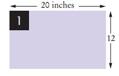

Bagian Kesimpulan

Selanjutnya, bergantian empat ubin sampai mencapai dinding timur. (lebar / 4 – 1 = 20 / 4 – 1 = 4)

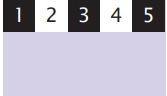

Ada ruang di selatan. Temukan ubin di awal baris yang sudah selesai. Warnanya hitam.Tempatkan ubin putih di sebelah selatannya.

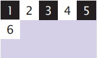

Lengkapi baris.

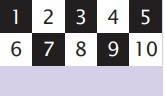

Masih ada ruang di selatan. Temukan ubin di awal baris yang sudah selesai. Dia putih. Tempatkan ubin hitam di selatannya.

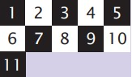

Lengkapi baris.

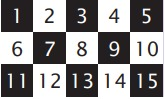

Sekarang seluruh lantai terisi, dan Anda selesai.

### **BAGIAN KESIMPULAN**

**Definisikan "program komputer" dan pemrograman.**

- Komputer menjalankan instruksi yang sangat mendasar secara berurutan.
- Program komputer adalah urutan instruksi dan keputusan.
- Pemrograman adalah tindakan merancang dan mengimplementasikan program komputer

**Menjelaskan komponen-komponen komputer**.

- Unit pemrosesan pusat (CPU) melakukan kontrol program dan data
pengolahan.
- Perangkat penyimpanan termasuk memori dan penyimpanan sekunder.

**Bagian 1** Pengenalan

**Jelaskan proses menerjemahkan bahasa tingkat tinggi ke kode mesin.**

- Java awalnya dirancang untuk memprogram perangkat konsumen, tetapi yang pertama
berhasil digunakan untuk menulis applet Internet.
- Java dirancang agar aman dan portabel, menguntungkan pengguna Internet dan
siswa penyok.
- Program Java didistribusikan sebagai instruksi untuk mesin virtual, membuatnya
platform-independen.
- Java memiliki perpustakaan yang sangat besar. Berfokuslah untuk mempelajari bagian-bagian perpustakaan yang Anda
kebutuhan untuk proyek pemrograman Anda

**Kenali lingkungan pemrograman Java Anda.**

- Sisihkan waktu untuk membiasakan diri dengan lingkungan pemrograman yang Anda
akan digunakan untuk tugas kelas Anda.
- Editor adalah program untuk memasukkan dan memodifikasi teks, seperti program Java.
- Java peka huruf besar/kecil. Anda harus berhati-hati dalam membedakan antara huruf besar dan huruf kecil.
- Kompilator Java menerjemahkan kode sumber ke dalam file kelas yang berisi instruksi
untuk mesin virtual Java.
- Kembangkan strategi untuk menyimpan salinan cadangan pekerjaan Anda sebelum terjadi bencana.

**Jelaskan blok bangunan dari program sederhana.**

- Kelas adalah blok bangunan dasar dari program Java.
- Setiap aplikasi Java berisi kelas dengan metode utama. Ketika aplikasi
dimulai, instruksi dalam metode utama dieksekusi.
- Setiap kelas berisi deklarasi metode. Setiap metode berisi urutan
instruksi.
- Sebuah metode dipanggil dengan menentukan metode dan argumennya.
- String adalah urutan karakter yang diapit tanda kutip

**Klasifikasikan kesalahan program sebagai kesalahan waktu kompilasi dan waktu proses.**

- Kesalahan waktu kompilasi adalah pelanggaran aturan bahasa pemrograman yang
dideteksi oleh kompiler.
- Kesalahan run-time menyebabkan program melakukan tindakan yang tidak dilakukan oleh programmer
bermaksud.

**Tulis pseudocode untuk algoritma sederhana.**

- Sebuah algoritma untuk memecahkan masalah adalah urutan langkah-langkah yang
tidak ambigu, dapat dieksekusi, dan diakhiri.
- Pseudocode adalah deskripsi informal dari urutan langkah-langkah untuk
memecahkan masalah

**ITEM PERPUSTAKAAN STANDAR DIPERKENALKAN DALAM BAB INI**

    java.io.PrintStream

     print

    println

    java.lang.System.out
